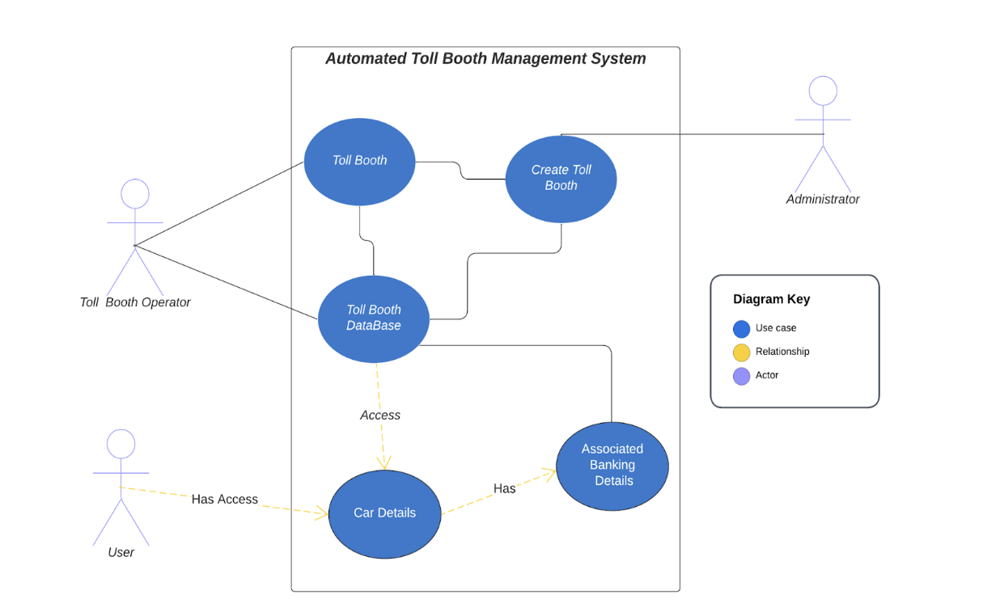
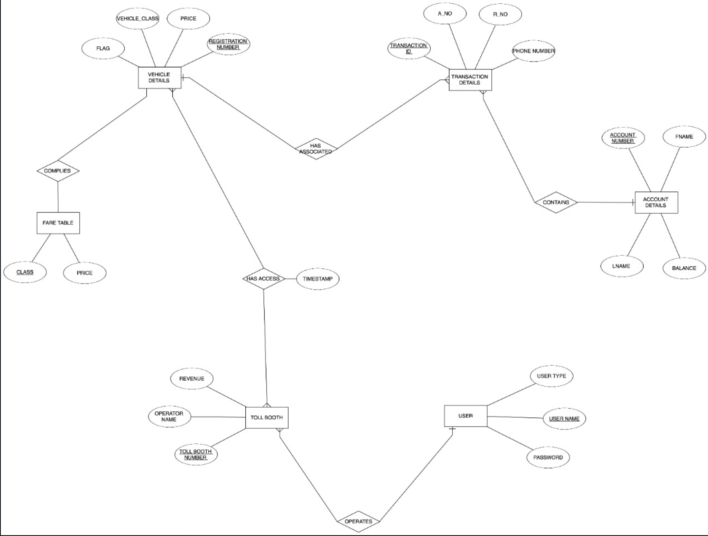

# AutomatedTollBoothSystem
### Use-Case Diagram

### ER-Diagram of the Database

## Dependencies
### To mask the passwords at the time of input:
Download maskpass package by running: 
```console
pip3 install maskpass
```
### To show a Table format for data:
Download prettytable package by running:
```console
pip3 install prettytable
```
### To see full functionality of the Application:
Download simple_chalk
```console
pip3 install simple_chalk
```
Download Inquirer
```console
pip3 install inquirer
```

